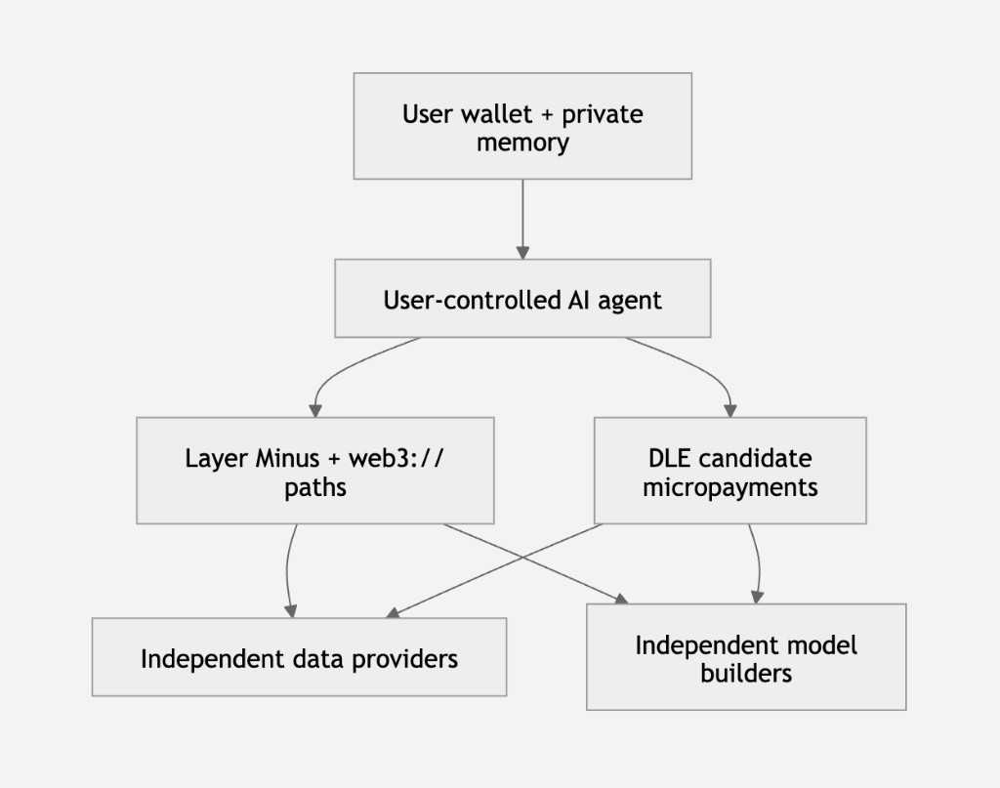

# Privacy-first Decentralized AI — Whitepaper

**Maturity: Design direction · Concept draft v0.11.** This paper is an
architecture and economic thesis. It is not a shipped GPU marketplace,
training network, data market, or decentralized AI product.

Public site:
[https://gitbook.conet.network/applications/privacy-first-ai-whitepaper.html](https://gitbook.conet.network/applications/privacy-first-ai-whitepaper.html)

Landing digest:
[Privacy-first Decentralized AI](privacy-first-ai.md)

The same destination appears on
[conet.network](https://conet.network/#privacy-first-ai)
and in
[Permissionless cloud and zero-trust applications](../l0/permissionless-cloud.md).

**Boundaries (stated once).** This paper does not claim absolute
neutrality, Layer Minus anonymity, a live CoNET-DLE AI settlement rail, or
a mathematically unbiased model. The three public roles stay independent
only as a **verifiable control-domain property**, not as a count of
wallets. Micropayments are the **design** that keeps that independence
from collapsing. Residual risk, evidence, and the research stages live in
**Threat Model** and **Maturity and Roadmap**.

---

**Eyebrow:** PRIVACY-FIRST DECENTRALIZED AI

**Headline:** Three independent roles. One open intelligence economy.

**Subtitle:** From users who are observed and predicted, to autonomous
intelligence subjects who hold data rights, model choice, and their own AI
agents.

**Closing line:** Privacy creates independence. Micropayments make
independence sustainable.

**Design principle:** Do not ask users to trust a platform that calls itself
neutral. Make bias, interest, and authority visible enough to compare,
refuse, and replace.

---

## 1. Executive Thesis

Centralized AI combines models, data, and user agents under one platform.
The operator that answers a question can also observe the user over time,
infer preference, predict the next action, and reshape the choice
environment. Those are related stages of one loop, not one undifferentiated
act. That is a **closed power loop**, not a neutral scientific process.

CoNET’s destination is the opposite production relationship:

- **data providers**, **model builders**, and **user-controlled AI agents**
  are independent, replaceable, wallet-addressed roles;
- **Layer Minus** and **`web3://`** reduce the need for one network
  intermediary to observe the complete user–service relationship. That
  benefit is conditional on operator separation, client-side key control,
  route diversity, limited identifier reuse, and the absence of
  collusion;
- **CoNET-DLE** is designed so measurable contributions can be paid as
  separate events. Model inference, licensed data access, verification, and
  sealed infrastructure work are **candidate** AI-market events, not frozen
  DLE tip classes.

The achievable goal is not a model without values. It is **contestable
intelligence**: provenance that can be traced, selection that can be
disclosed, conflicts that can be seen, multiple sources and models that can
compete, agents that users can replace, and **no single participant that
simultaneously controls observation, interpretation, and action**.

### 1.3 Observation, prediction, and intervention

Platform analysis, prediction, and choice-shaping are related, but they
are **not the same capability**. The closed loop has three stages:

| Stage | Capability | Risk |
| --- | --- | --- |
| **Observation** | Collects behavioral and relational metadata | Privacy and power asymmetry |
| **Prediction** | Infers preference, risk, and the next action | Covert classification and differential treatment |
| **Intervention** | Changes ranking, price, content, or agent action | The user's choice environment is manipulated |

**Prediction is not intervention.** The governance risk becomes more
severe when the same actor that predicts a user also controls the
ranking, price, recommendation, or agent action presented to that user.
Independent prediction — for example a model that estimates risk without
setting the price or the next action — is not automatically manipulation.
The power loop closes when observation, prediction, and intervention sit
in one control domain.

---

## 2. The Closed AI Power Loop

A centralized stack does not begin with a neutral fact. It begins with
**collection** and **selection**. The same operator decides which logs,
crawls, chats, and sensor streams enter the corpus; which sources are
ranked or dropped; which labels count; which evaluation suites define
“quality”; and which user exhaust is retained as training fuel.

A corpus is **fed**. It is curated by a product, a jurisdiction, a
customer, and a risk model. Exclusion is as powerful as inclusion.

### “Raw” was never outside selection

So-called raw data is only data that has not yet been processed later. It
is not data without a method, and it is not a neutral fact
([4], [5], [6]). Sensor placement, sampling rate, search ranking,
language resources, device price, missing-value policy, and retention
rules decide what can enter. Collection and labeling are social choices:
annotation guidelines, culture, organizational interest, and that
moment’s knowledge boundary enter the record ([5], [6], [7]).
Unrecorded people do not become training material. High-frequency
records can be mistaken for what is more important or more common.

| Bias | What it does |
| --- | --- |
| **Collection bias** | A platform only sees behavior inside its service, then treats “recordable” as “the real world.” |
| **Selection bias** | Buyers, labelers, or sponsors decide which sources stay and which outliers drop. |
| **Incentive bias** | Ads, retention, risk, or political goals define “useful signal.” |
| **Label bias** | Labels reflect annotation rules, culture, organizational interest, and that moment’s knowledge boundary. |
| **Survivor bias** | People who were deleted, silent, device-poor, poorly connected, or unable to pay are systematically absent. |

### Models freeze those choices

Training compresses statistical structure, absence, and labeling rules into
repeatable output. Objectives, reward models, safety rules, fine-tunes, and
system prompts add new value choices. When data, weights, benchmarks, and
deployment policy sit in one organization, a user cannot tell whether an
answer is a fact, a distribution, a model limit, or a result the platform
wants to shape.

A technically strong model can still err systematically for particular
people, languages, or uses. Model documentation and open weights make
those choices inspectable; they do not automatically remove them
([8], [9], [10], [11], [12], [13]). NIST treats trustworthy AI as
socio-technical properties traded across a lifecycle — valid and
reliable, safe, secure and resilient, accountable and transparent,
explainable, privacy-enhanced, and fair with harmful bias managed.
Transparency is not fairness. See
[NIST AI RMF 1.0](https://www.nist.gov/itl/ai-risk-management-framework)
and
[NIST AIRC](https://airc.nist.gov/airmf-resources/airmf/)
([1], [2]).

### Captured agents close the loop

Once a platform owns the model, it also tends to own the **agent**. The
same operator collects interaction, trains and ranks the model, hosts the
assistant, stores history and tool traces, and bills — or advertises
against — the same identity. The agent looks independent while remaining a
surface of the platform.

A model can be packaged and replaced as a capability — including weights,
tokenizer, system prompt, safety policy, inference runtime, retrieval,
tools, and an update pipeline. An agent is a continuing relationship: it
retains context, holds authority, selects services, and mediates action
over time. If the agent, the trainer, and the data custodian are the same
firm, “the assistant works for you” is a slogan, not an ownership fact.

When that firm also supplies identity, search, messaging, payment, and
location, it holds a trajectory: what was asked, when, with whom, what was
bought, which answers were acted on, and how risk preference changed. Even
if content is encrypted at rest, stable identifiers, time, frequency,
device, location, contacts, and payment relations still form high-value
metadata. Traffic analysis and contextual integrity research show that
such relational traces can support sensitive-attribute inference
([20], [21], [22], [23]). Profiling and inferred data can
classify a person without that person having disclosed the attribute
([24], [25]).

**Prediction is not intervention.** Ranking, price, credit, advertising,
and automatic agent authority are interventions: they change the choice
environment presented to the user ([26], [27], [28]). The
governance risk becomes more severe when the same actor that predicts a
user also controls those presentations. The risk is not only a leak. It
is lawful collection under asymmetric power.

**Key risk:** A subject that holds the complete history can describe the
user’s past — and may predict the next action earlier than the user can.

---

## 3. Contestable Data, Models and Agents

This paper does not define neutrality as having no standpoint. It defines
**contestable intelligence**: power that cannot hide its standpoint, and
cannot stop the user from choosing another source.

“Contestable model supply” and “independently sourced data” are
**production relationships** and an **operational test**, not theorems. A
model that is independently owned is not therefore unbiased.

### Independently sourced data

Independently sourced data means data contributed under the provider’s
own provenance, license, disclosure, and payment terms—not exclusively
selected and preconditioned by the platform that owns the model and the
user agent.

Contribution is optional and attributable. Sensitive material can be
fragmented and encrypted so one collector is not the universal custodian.
Payment can attach to a measurable access or attestation, rather than to a
one-time surrender of the dataset.

A **fed corpus** remains a legitimate scientific method. The objection is
making it the **only** path, owned by the same operator as the agent, and
pre-selected to support a conclusion that operator already prefers.

### Contestable model supply

A contestable model is **not assumed to be unbiased**. It is independently
selectable, replaceable, and comparable. Its provenance, evaluation
results, policy constraints, sponsorship, and economic interests can be
disclosed and tested against competing models.

The goal is not neutral intelligence. It is an intelligence market in
which **no single model owner can make its bias unavoidable**.

Independent ownership of the model, the agent, and the user’s data
exhaust is a **necessary condition** of that market, not a proof that
the model is fair. An independent builder can still train on a skewed
corpus, accept a government or commercial sponsor, hide training
sources, tune the model to a political or commercial objective, or form
a de facto alliance with a data provider. Those failures are why
disclosure, comparison, and replacement are required.

Users and agents can choose and pay independent builders. The builder
does not automatically receive complete prompts, complete user graphs,
or custody of the data-provider network. Training policy, if published,
is that builder’s artifact — not a hidden ranking layer of the same
firm that hosts the assistant.

### User-controlled agents

The agent is chosen by the user and holds **limited**, task-scoped
authority: discover services, construct the task, control budget, minimize
disclosure, verify results, and keep only the memory the user chose to
keep. Agents should be replaceable, exportable, and revocable. High-risk
actions keep a human as the final decision. Keys and long-term memory must
not become a default asset of the model provider.

Interaction history is a user-generated cognitive asset, not a natural
by-product of a platform. A model that receives data for one inference
should not therefore receive a permanent right to train, profile,
advertise, score risk, or resell.

### Independence is a verifiable property

Three wallets do not prove three independent powers. Three companies, three
SDK names, or three product cards do not either.

The same ultimate beneficiary can still control all three roles. They can
share one cloud, one login system, one analytics database, one SDK that
returns complete logs, one payment address that re-links the graph, or a
private exclusive contract. Role labels then become a presentation of
concentration, not a check on it.

Role separation becomes meaningful only when ownership, infrastructure,
logging, authorization, and economic interest are also separated—or when
their overlap is explicitly disclosed.

An implementation should therefore disclose:

- beneficial ownership and control relationships;
- shared infrastructure and logging domains;
- exclusive commercial agreements;
- model-routing commissions;
- data-provider sponsorship;
- common administrators and upgrade authorities;
- whether one operator can reconstruct the complete
  user–agent–model–data graph.

**Decentralization is not the number of addresses. It is the inability of
one control domain to reconstruct and govern the whole relationship.**

### Operational evaluation matrix

| Requirement | Data layer | Model layer | Agent layer |
| --- | --- | --- | --- |
| **Provenance** | Collector, time, method, coverage, and license can be traced | Training-source summary and version can be traced | Which model and data services were used can be recorded |
| **Diversity** | Independent sources can compete and cross-check | Independent model outputs can be compared | Services and composition strategy can be replaced |
| **Interest disclosure** | Who paid for collection and who benefits | Optimization goal, sponsorship, and policy constraints | Recommendation, routing, and commission relations are visible |
| **Refusal** | Withdraw or restrict future use | Refuse an unfit model version | Revoke authority, budget, and long-term memory access |
| **Evaluation** | Representation, gap, and contamination metrics | Bias, robustness, privacy, and fitness evaluation | Behavior logs, authorization bounds, and result review |
| **Control-domain independence** | Collector is not the same undisclosed operator as the model and the agent | Builder is not the same undisclosed operator as the agent and the data network | Agent host cannot reconstruct the complete user–model–data graph without disclosure |

---

## 4. Three Independent Roles

CoNET splits the production chain into three replaceable, competing,
interest-independent roles. The split is not meant to add middlemen. It is
meant to stop any one party from owning the user, the data, the right to
interpret, and the right to act at the same time. Three wallets do not
prove that split. Independence is a **verifiable property** of ownership,
infrastructure, logging, authorization, and economic interest — or of
honest disclosure when those domains overlap.

| Role | Line | Owns or controls | Should not default to receiving |
| --- | --- | --- | --- |
| **MODEL BUILDERS** | Build intelligence without owning the user. | Models, inference, versions, evaluation results, and call prices | The user’s long-term relationship graph, unlicensed raw data, or the agent’s keys |
| **DATA PROVIDERS** | Contribute data without surrendering control. | Provenance, license terms, quality claims, price, and withdrawal rules | The user’s complete identity, all model weights, or secondary use beyond the license |
| **AI AGENTS** | Act for users without becoming the platform. | User authorization, task context, budget, and service choice | Long-term surveillance beyond the task, irrevocable payment rights, or platform lock-in |

Infrastructure operators (forwarding, sealed storage, untrusted compute)
are a **supporting plane**, not a fourth public product card. They may be
paid for measurable sealed work. They should not receive business
plaintext, complete datasets, or an end-to-end social graph.

<strong>Figure 1.</strong> How the architecture separates control, coordination, and payment.

<ul>
<li><strong>L0</strong> is responsible for private coordination.</li>
<li><strong>L1</strong> is responsible for identity, assets, and final settlement.</li>
<li><strong>DLE</strong> is responsible for the candidate high-frequency event ledger.</li>
<li>The <strong>agent</strong> receives only limited, task-scoped authorization.</li>
<li>Data, models, and payment events should not share the same long-lived identifier by default.</li>
</ul>

The top box is the L1 surface the user holds: wallet identity, assets, and
final settlement. The agent sits below that surface. Layer Minus and
`web3://` carry private coordination. DLE records candidate high-frequency
payment events. Independent data providers and model builders sit at the
edge.

People, devices, communities, and applications can offer data or attested
signals for a stated task, with source, sampling conditions, coverage,
known gaps, license, validity window, and price. Model developers can
publish specialized inference as a wallet-addressed service and earn from
actual calls without controlling the user account or complete raw data.
Multiple models can compete on the same task. An agent can compose,
compare, or cross-check results.

---

## 5. Private Coordination

**Implementation status.** Layer Minus forwarding is an implemented L0
capability. `web3://` has implemented v1 components, including wallet
locators, signed requests, encrypted response correlation, Linux runtime
support, and early persistent streams. Complete cross-platform handling
and general public hosting remain under development. See
[`web3://` wallet-addressed applications](web3-url.md) and the
[`web3://` Application Protocol](../l0/web3-application-protocol.md).

Layer Minus and `web3://` reduce the need for one network intermediary to
observe the complete user–service relationship.

This benefit is conditional on operator separation, client-side key
control, route diversity, limited identifier reuse, and the absence of
collusion. Protocol-role separation alone does not prove legal-entity or
infrastructure independence.

Two conditions are required before that design goal can be treated as a
user-facing privacy claim:

1. **Entry, mailbox, and application services must be operated by
   different control domains.** One company can still run A, B, and C.
   Distinct nodes can still collude. Role labels do not prove legal-entity
   or infrastructure independence.
2. **Users must not always use the same public wallet identity for every
   task.** A long-lived wallet can become a stronger correlator than an IP
   address. Payments, model calls, and data requests can recreate the
   relationship graph even when network paths are split.

Official CoNET documentation already states that wallet addressing is
**pseudonymous, not automatically anonymous**. Network timing, traffic
size, public-chain activity, and endpoints can still be linked
([trust boundary](README.md#trust-boundary);
[TCP/IP privacy](../l0/tcp-ip-privacy.md);
[security limits](../l0/security-limits.md)). The AI agent itself may
still observe the complete user–model–data relationship it is authorized
to assemble.

In the proposed application model, the durable application owner is
represented by a wallet identity. Layer Minus routing additionally
depends on OpenPGP identity and mailbox-route bindings; an exact
`@BeamioTag` may provide an application-facing alias. This is not a
durable public origin that every peer must learn.

`web3://` names an application by that wallet identity and returns an
encrypted, request-correlated response or a persistent stream. See the
[`web3://` Application Protocol](../l0/web3-application-protocol.md) and
[`web3://` wallet-addressed applications](web3-url.md).

Layer Minus carries wallet- and OpenPGP-addressed encrypted messages above
ordinary TCP/IP. A client submits a signed, encrypted object to an entry.
Nodes forward by key identity to a mailbox or service path. Logical identity
can move across underlying nodes.

An entry may still observe a source IP. A hop may see time, volume, and the
next hop. Public wallet activity may still be linked. Protocol roles
reduce what **one network intermediary must be given** — they do not
prove that user identity, service location, business content, and the
relationship graph cannot be reconstructed.

Forwarding is an A/B/C path: send business ciphertext through a healthy
**entry A ≠ mailbox B**; listen with a command encrypted to **B**, over a
healthy **entry C ≠ B**. Intermediate nodes carry ciphertext and routing
key IDs, not product plaintext. Entry, mailbox, and hop nodes are **not**
the product platform. L0 GPU or other compute hosts remain **untrusted**.
Encrypted fragmentation, independently controlled keys, and verifiable or
redundant execution stay application-layer work.

See [Zero-trust mailbox routing](../l0/mailbox-routing.md) and
[The IP-address privacy problem](../l0/tcp-ip-privacy.md).

| Rule | Meaning |
| --- | --- |
| **Minimum disclosure** | Each task supplies only the context, fields, and time range needed to finish that task. |
| **Short association** | Rotate routing identity or delegated credentials across services, sessions, or purposes. |
| **Endpoint memory** | Long-term preference and history stay in a user-controlled client when possible. |
| **Fragmentation and encryption** | Applications should encrypt and fragment sensitive state so that no single storage provider receives enough material to reconstruct the whole. Fragmentation thresholds, redundancy, recovery, deletion, and availability verification remain application-specific requirements. |
| **Separated settlement** | **Design requirement**, not a live capability. A future payment should prove only the service right, amount, and settlement condition for one interaction. Wallet payments and DLE do not provide this automatically. |
| **Revocable authority** | Agent spend, data license, and service delegation must have scope, cap, term, and a revocation path. |

Layer Minus provides forwarding and mailbox primitives. Fragmentation and
higher-layer client cryptography are application compositions. They are
**not** automatic properties of all L0 traffic.

**Privacy goal:** A platform must not obtain, from a single model call, the
complete long-term behavioral data needed to predict the user’s future
action.

---

## 6. Economic Coordination

Role separation without income only raises coordination cost. When
independent contributors lack a direct revenue path, they become
economically dependent on the platform that subsidizes distribution,
billing, or infrastructure. That dependency creates pressure to
re-centralize ownership, surrender data rights, or monetize user
relationships indirectly.

**CoNET-DLE** is designed as a high-frequency, event-driven application
ledger so small value can follow a measurable contribution. That is the
intended economic condition of independence. It is **not** a claim that
DLE already settles production AI micropayments, or that every listed AI
interaction is already a normative DLE tip class.

#### AI event classes are proposed, not yet normative

The examples below are **candidate** AI-market events. They are not
presently frozen DLE tip classes. Each would require its own
deterministic state machine, evidence format, replay rules, completion
criteria, dispute process, privacy boundary, and release gates.

Official developer documentation still lists DLE as a **normative
design and experimental environment**, not a production SDK or a
launched L2 service. See [L2 development](../developers/l2.md).

### Privacy-preserving settlement requirement

A future AI payment protocol should prove only the service right, amount,
and settlement condition required for one interaction. It should avoid
placing prompts, dataset identifiers, long-term agent identity, or the
complete service graph on a public ledger.

This property requires a specified payment-session and unlinkability
design; it is not provided automatically by wallet payments or by DLE.

A public-chain micropayment can **add** metadata rather than hide it.
The current stack has not yet specified:

- which fields a payment proof contains;
- whether wallets are reused across models, data, and payments;
- whether a payee can join a payment to a request;
- how aggregated payment is implemented;
- whether session accounts exist;
- how payment and service delivery are atomically bound;
- whether DLE events are public;
- which fields enter L1;
- whether zero-knowledge or another minimum-disclosure proof is used.

Until that design exists, “a payment proof does not expose the
conversation, dataset, or social graph” is a goal, not an implemented
guarantee.

| Candidate event (not a frozen DLE tip class) | Who can be paid | Verifiable basis | Must not be required |
| --- | --- | --- | --- |
| Model inference | Model builder | Version, request commitment, completion or verification, and price rule | Custody of the user agent or the full prompt graph |
| Licensed data access | Data provider | License scope, use count, validity window, or aggregate proof | Permanent surrender of the dataset to one platform |
| Agent work | Agent developer or operator | A user-authorized task or subscription | Owning the model and the data network |
| Ciphertext forward | L0 network provider | Attested forwarded bytes and path accounting | Reading business plaintext |
| Sealed storage | Storage provider | Capacity, retention, availability, and retrieval proof | Reconstructing the object |
| Verification / archive | Validators and Archive groups | Final events, availability, and protocol rules | Becoming the product platform |

DLE economics distinguish protocol-value fee, execution reserve, and
availability budget. The current DLE economic design targets a
one-basis-point protocol value fee for specified classes of applicable
value movement. This is not a universal all-in fee for every AI task.

Inference execution, data access, proof verification, L1 settlement,
retries, storage, and availability may carry separate measured costs
under future class-specific fee schedules.

That one-basis-point figure is a **design target** for specified value
movement and transaction settlement. It is not a production fee
schedule, not a per-inference tax, and not a claim that every AI
payment already runs at that rate. Execution reserves, L1 gas, proofs,
data availability, and fixed available capacity are separate economic
responsibilities in the DLE economics digest. See
[DLE economics](../l2/economics.md). That parameter still requires
implementation, audit, and market validation.

Under this design:

- models earn from authorized inference, not from owning data;
- data providers earn from scoped or counted access, not from a permanent
  copy sale;
- a user budget can route an agent across models and data sources;
- infrastructure earns from measurable sealed work;
- users can pay explicit, fine-grained, capped fees instead of “free
  service” priced in behavioral data.

Existing L0/L1 primitives (for example Guardian work and GB resource
accounting) show that measurable contribution can already be paid on CoNET
infrastructure. They are not re-labeled here as a general AI marketplace.

See [L2 — CoNET-DLE](../l2/README.md), [L2 economics](../l2/economics.md),
and [Design thesis](../l2/design-thesis.md).

---

## 7. Protocol Requirements

Open weights, decentralized storage, public settlement, and federated
learning each improve one surface. None of them, alone, breaks the closed
loop.

| Approach | What it improves | What it still leaves concentrated |
| --- | --- | --- |
| Open-weight models | Inspection, reproduction, or local deployment of part of the capability | Data provenance, online-service metadata, and agent control |
| Decentralized storage | Single-store failure and some platform lock-in | Index, keys, relationship graphs, and access logs |
| Public-chain settlement | Publicly verifiable assets and rules | Address/transaction linkage; a micropayment can add metadata rather than hide it; query privacy is not automatic |
| Federated learning / confidential compute | Lower raw-data concentration under a stated threat model ([14], [15], [16]) | Feature leakage, membership inference, and backdoors remain under adversarial participants or aggregators ([17], [18], [19]) |

A later “open weights” release does not undo dependence if the training
path, the exclusion list, and the user-relationship graph remain under one
operator.

A single honest platform could publish weights, buy data under contract,
and run a polite assistant. That still leaves collection, the agent, and
the prediction graph in one login warehouse. Decentralization here is not a
slogan for more GPUs. It is the refusal of a single production
relationship:

1. Collection starts non-neutral when the trainer also decides the corpus.
2. The agent is not independent of the trainer on one login graph.
3. Metadata remains a prediction instrument even when message bodies are
   encrypted at rest.
4. Unpaid roles re-merge into the subsidizing platform.

The protocol stack that matches those refusals is:

- **wallet-owned application identity plus OpenPGP and mailbox-route
  bindings**, not a durable public origin and not a wallet address alone;
- **A/B/C encrypted forwarding**, with untrusted compute hosts;
- **metadata minimization** and user-controlled endpoint memory;
- **separated, event-priced settlement as a design requirement**, so each
  role can earn without owning the stack, without publishing the prompt,
  dataset identifier, or complete service graph;
- **identifier separation** so data, model, and payment events do not share
  one long-lived ID by default.

Centralized stacks remain free to exist. CoNET’s claim is that they should
not be the **only** path, and that a wallet-addressed cloud already has
forwarding and identity pieces needed to **design** the other path.
Privacy-preserving settlement is still a specified requirement, not an
automatic property of wallet payments or DLE.

---

## 8. Threat Model

Privacy-first is not absolute anonymity and not absolute truth. Nodes may
drop, record, or lie. Data providers may forge provenance. Models may hide
bias or a back door. Agents may over-authorize. User devices may be
compromised. Wallets, time, and traffic may be linked. Payment may face
Sybil attack, fake traffic, and collusion.

| Threat | Main mitigation direction | Residual risk |
| --- | --- | --- |
| Traffic correlation | Separate entry/mailbox roles; path rotation; padding and batching as research ([20], [21]) | A strong observer can still use time and volume |
| Fake or “fed” data | Provenance proofs, multi-source cross-check, stake/challenge, quality reputation | True source is not the same as true content or fair representation |
| Biased models | Public evaluation cards, versioning, competing models, cross-check | Evaluation sets can themselves be biased or optimized against |
| Malicious agents | Least privilege, budget caps, simulation, human confirmation, revocation | A compromised endpoint can still leak data inside the granted scope |
| Economic manipulation | Anti-replay, attributable work, caps, dispute and penalty mechanisms | Small events can be forged in bulk or amplified by collusion |
| On-chain profiling | Delegation, session accounts, payment aggregation, minimal public proofs — **all still unspecified for AI settlement** | Public settlement still leaves an analyzable trace |
| Ledger over-disclosure | Specify a payment-session and unlinkability design; prove only right, amount, and settlement condition | A wallet or DLE micropayment can **add** a joinable payment graph instead of hiding the relationship |
| Role-label capture | Disclose beneficial ownership, shared infra and logs, exclusive deals, routing commissions, common upgrade authority | Three addresses can still share one control domain |
| Operator correlation | Disclose control-domain overlap; require distinct operators for entry, mailbox, and application hosts | Entry, mailbox and application hosts may be controlled by the same entity |
| Stable-wallet correlation | Use session or purpose-limited wallets; do not reuse one public identity across models, data, and payments | Reusing one wallet across models, data and payments can recreate the relationship graph |
| Agent visibility | Least privilege, exportable agents, and user-held memory | A user agent may itself observe all selected models, data sources and actions |
| Cross-layer correlation | Separate identifiers; aggregate payments; avoid joining L0 timing to L1/DLE traces | L0 timing and L1/DLE payments may be joined statistically |

UNESCO’s
[Recommendation on the Ethics of Artificial Intelligence](https://www.unesco.org/en/artificial-intelligence/recommendation-ethics)
treats proportionality, safety, fairness, and human oversight as public
obligations ([3]). This paper uses those duties as **design constraints**,
not as a claim that CoNET already satisfies them.

See [How to use Layer Minus](../l0/using-l0.md),
[Security limits](../l0/security-limits.md), and
[Permissionless cloud](../l0/permissionless-cloud.md).

---

## 9. Governance

Decentralized AI must not only move control from a corporate board to token
whales or a small set of infrastructure admins. Protocol governance should
separate technical upgrades, data standards, model evaluation, economic
parameters, and dispute handling, and should disclose the real authority of
each control surface.

- **Public specification and versioning** for protocol messages, data
  licenses, model declarations, agent authorizations, and fee rules.
- **Independent audit** of network, contracts, agent authority, key
  recovery, payment, and upgrade rights.
- **Repeatable evaluation** that publishes method, sample bounds, failure
  cases, and results — not only a single score.
- **Power map** for admin, multisig, upgrade, pause, Guardian admission,
  Treasury, and Archive control sets.
- **Correction paths** for data subjects, providers, model parties, and
  users.
- **Progressive decentralization** measured by independent operators, ASN
  diversity, client diversity, real traffic, income concentration, and
  whether one control domain can still reconstruct the complete
  user–agent–model–data graph.

---

## 10. Maturity and Roadmap

| Claim in this paper | Status |
| --- | --- |
| Centralized collection/training/serving/billing is a concentrated power structure | Thesis |
| Layer Minus + `web3://` reduce the need for one network intermediary to observe the complete user–service relationship | Architecture goal — **conditional** on operator separation, client-side keys, route diversity, limited identifier reuse, and no collusion |
| `web3://` is a complete production cross-platform handler and public hosting service | **Not claimed** — v1 components exist (locators, signed requests, encrypted response correlation, Linux runtime, early streams); complete handlers and general public hosting remain under development |
| Application identity is only a wallet address | **Not claimed** — the durable owner is a wallet identity; Layer Minus routing also depends on OpenPGP and mailbox-route bindings; `@BeamioTag` is an optional alias |
| All L0 traffic is automatically fragmented so no node holds a reconstructable whole | **Not claimed** — applications should encrypt and fragment sensitive state; thresholds, redundancy, recovery, deletion, and availability verification are application-specific |
| Three roles can remain independent if paid per contribution | Design destination — independence is a disclosed control-domain property, not a wallet count |
| CoNET-DLE can carry small, frequent multi-party payments | Design target / lab evidence — not a production L2 launch |
| The 1 bp protocol-value fee is a universal all-in fee for every AI task | **Not claimed** — 1 bp targets specified classes of applicable value movement |
| AI event classes (inference, licensed data access, verification) are frozen DLE tip classes | **Not claimed** — proposed candidates; each needs its own state machine and release gates |
| Privacy-preserving settlement: a payment proves only the service right, amount, and condition, without prompts, dataset IDs, long-term agent identity, or the complete service graph | **Design requirement** — not provided automatically by wallet payments or by DLE |
| Contestable intelligence can be compared across data, model, and agent layers | Thesis / evaluation destination |
| A staged data-market, multi-model agent market, or DLE AI rail is in production | **Not claimed** |
| A general GPU marketplace, training network, or data market is in production | **Not claimed** |
| Layer Minus provides anonymity | **Not claimed** |
| CoNET hosts a globally unbiased dataset or a zero-bias model | **Not claimed** |
| Decentralized AI is a live CoNET product name | **Not claimed** |
| Any listed Guardian is an honest compute or data host | **Not claimed** |
| Prediction is automatically intervention, or every predictive analysis is manipulation | **Not claimed** — prediction and intervention are distinct stages; the governance risk grows when the same actor does both |
| This architecture automatically produces truth or removes bias | **Not claimed** |

Evidence that **does** exist, and should not be confused with this paper:

- Layer Minus encrypted entry/mailbox forwarding is an implemented L0 plane.
- CoNET L1 is a public EVM network.
- CoNET Chat and related applications compose private paths over that plane.
- CoNET-DLE has published specifications and a lab explorer. That is draft /
  lab evidence, not a production AI rail.

| Stage | Main delivery | Pass standard |
| --- | --- | --- |
| **I · Composable base** | L0 encrypted routing, Chat/Agent SDK, `web3://` service adaptation, L1 identity and assets | Third parties can reproduce; authority and metadata bounds are documented |
| **II · Private data-market trial** | Provenance statements, license credentials, one-time or aggregate access, data-quality challenges | Real independent providers; withdrawal and use limits are enforceable |
| **III · Multi-model agent market** | Model cards, versions, evaluation, agent budgets, and service switching | Users can change model or agent without lock-in; no single default supplier |
| **IV · DLE micropayment trial** | Settlement of inference, data, network, and verification events | Cost below delivered value; anti-replay, caps, and dispute are verifiable |
| **V · Production qualification** | Security audit, long-run availability, dispersed governance, failure drills | Continuous-run metrics, independent operators, and real paid loops are public |

Success should be counted as **user control and dispersed power**: tasks
that complete without a complete identity graph; independent providers that
earn real revenue; the cost of replacing an agent; long-term metadata
concentration; and whether failure of any one operator, model, or
payment-control set terminates the whole system.

Stages II–V are research and product work. Maturity labels are not an
audit, SLA, or anonymity guarantee. This document is CoNET architecture,
not a Beamio product change.

---

## 11. Conclusion

The deepest risk of centralized AI is not one wrong answer. It is that one
subject long owns the closed loop of observation, prediction, and
intervention: collecting the user, inferring the next action, and then
changing the ranking, price, content, or agent action presented to that
user. Prediction is not automatically that last step. The loop becomes
severe when the same actor does all three. When selection bias in raw
data, training bias in the model, and commercial interest of the
platform reinforce one another, users cannot tell whether they are being
helped — or analyzed, classified, and steered.

Privacy-First Decentralized AI tries to break that loop. Data providers keep
data rights. Model builders earn from intelligence. AI agents choose
services for the user. Infrastructure operators earn from sealed work.
Those names are not enough: **decentralization is not the number of
addresses. It is the inability of one control domain to reconstruct and
govern the whole relationship.**
Layer Minus and `web3://` reduce the need for one network intermediary to
observe the complete user–service relationship. That benefit is
conditional. Protocol-role separation alone does not prove legal-entity or
infrastructure independence. DLE is **designed** so independent roles can
keep cooperating by measurable contribution. That is not a claim that
wallet payments or DLE already hide prompts, datasets, or the service
graph.

The contestability worth seeking is not a promise of fairness from one
power center. It is that **no single model’s bias is the only bias a
user can use** — and that no bias and no power can hide from choice,
inspection, and replacement.

**Final claim:** AI should learn the world. It should not do so by building
a central database that can predict and steer each user’s future.

Privacy creates independence.

Micropayments make independence sustainable.

---

## 12. References

Standards and public instruments:

1. NIST, *Artificial Intelligence Risk Management Framework (AI RMF 1.0)*,
   2023.
   [https://www.nist.gov/itl/ai-risk-management-framework](https://www.nist.gov/itl/ai-risk-management-framework)
2. NIST AIRC, *AI Risks and Trustworthiness*; AI RMF Core: Govern, Map,
   Measure, Manage.
   [https://airc.nist.gov/airmf-resources/airmf/](https://airc.nist.gov/airmf-resources/airmf/)
3. UNESCO, *Recommendation on the Ethics of Artificial Intelligence*,
   adopted 2021; publication updated 2024.
   [https://www.unesco.org/en/artificial-intelligence/recommendation-ethics](https://www.unesco.org/en/artificial-intelligence/recommendation-ethics)

Data documentation and the claim that “raw data” is not a neutral fact:

4. Gitelman, L. (ed.), *“Raw Data” Is an Oxymoron*, MIT Press, 2013.
   [https://mitpress.mit.edu/9780262518284/raw-data-is-an-oxymoron/](https://mitpress.mit.edu/9780262518284/raw-data-is-an-oxymoron/)
5. Gebru, T., Morgenstern, J., Vecchione, B., Vaughan, J. W., Wallach, H.,
   Daumé III, H., and Crawford, K., “Datasheets for Datasets,”
   *Communications of the ACM*, 64(12), 2021. Preprint:
   [https://arxiv.org/abs/1803.09010](https://arxiv.org/abs/1803.09010)
6. Bender, E. M., and Friedman, B., “Data Statements for Natural Language
   Processing: Toward Mitigating System Bias and Enabling Better Science,”
   *Transactions of the Association for Computational Linguistics*, 6,
   2018.
   [https://aclanthology.org/Q18-1041/](https://aclanthology.org/Q18-1041/)
7. Holland, S., Hosny, A., Newman, S., Joseph, J., and Chmielinski, K.,
   “The Dataset Nutrition Label: A Framework To Drive Higher Data Quality
   Standards,” 2018.
   [https://arxiv.org/abs/1805.03677](https://arxiv.org/abs/1805.03677)

Model reporting, bias, and algorithmic accountability:

8. Mitchell, M., Wu, S., Zaldivar, A., Barnes, P., Vasserman, L.,
   Hutchinson, B., Spitzer, E., Raji, I. D., and Gebru, T., “Model Cards
   for Model Reporting,” *Proceedings of FAT\**, 2019.
   [https://arxiv.org/abs/1810.03993](https://arxiv.org/abs/1810.03993)
9. Bender, E. M., Gebru, T., McMillan-Major, A., and Shmitchell, S., “On
   the Dangers of Stochastic Parrots: Can Language Models Be Too Big?,”
   *Proceedings of FAccT*, 2021.
   [https://dl.acm.org/doi/10.1145/3442188.3445922](https://dl.acm.org/doi/10.1145/3442188.3445922)
10. Selbst, A. D., Boyd, D., Friedler, S. A., Venkatasubramanian, S., and
    Vertesi, J., “Fairness and Abstraction in Sociotechnical Systems,”
    *Proceedings of FAT\**, 2019.
    [https://dl.acm.org/doi/10.1145/3287560.3287598](https://dl.acm.org/doi/10.1145/3287560.3287598)
11. Barocas, S., and Selbst, A. D., “Big Data’s Disparate Impact,”
    *California Law Review*, 104, 2016.
    [https://www.californialawreview.org/print/big-datas-disparate-impact](https://www.californialawreview.org/print/big-datas-disparate-impact)
12. Diakopoulos, N., “Accountability in Algorithmic Decision Making,”
    *Communications of the ACM*, 59(2), 2016.
    [https://dl.acm.org/doi/10.1145/2844110](https://dl.acm.org/doi/10.1145/2844110)
13. Raji, I. D., Smart, A., White, R. N., Mitchell, M., Gebru, T.,
    Hutchinson, B., Smith-Loud, J., Theron, D., and Barnes, P., “Closing
    the AI Accountability Gap: Defining an End-to-End Framework for
    Internal Algorithmic Auditing,” *Proceedings of FAT\**, 2020.
    [https://arxiv.org/abs/2001.00973](https://arxiv.org/abs/2001.00973)

Differential privacy and federated-learning threats:

14. Dwork, C., “Differential Privacy,” *ICALP*, 2006.
    [https://www.microsoft.com/en-us/research/publication/differential-privacy/](https://www.microsoft.com/en-us/research/publication/differential-privacy/)
15. Dwork, C., and Roth, A., *The Algorithmic Foundations of Differential
    Privacy*, Foundations and Trends in Theoretical Computer Science,
    2014.
    [https://www.cis.upenn.edu/~aaroth/Papers/privacybook.pdf](https://www.cis.upenn.edu/~aaroth/Papers/privacybook.pdf)
16. Kairouz, P., et al., “Advances and Open Problems in Federated
    Learning,” *Foundations and Trends in Machine Learning*, 2021.
    [https://arxiv.org/abs/1912.04977](https://arxiv.org/abs/1912.04977)
17. Melis, L., Song, C., De Cristofaro, E., and Shmatikov, V.,
    “Exploiting Unintended Feature Leakage in Collaborative Learning,”
    *IEEE Symposium on Security and Privacy*, 2019.
    [https://arxiv.org/abs/1805.04049](https://arxiv.org/abs/1805.04049)
18. Nasr, M., Shokri, R., and Houmansadr, A., “Comprehensive Privacy
    Analysis of Deep Learning: Passive and Active White-box Inference
    Attacks against Centralized and Federated Learning,” *IEEE Symposium
    on Security and Privacy*, 2019.
    [https://arxiv.org/abs/1811.12495](https://arxiv.org/abs/1811.12495)
19. Bagdasaryan, E., Veit, A., Hua, Y., Estrin, D., and Shmatikov, V.,
    “How To Backdoor Federated Learning,” *AISTATS*, 2020.
    [https://arxiv.org/abs/1807.00459](https://arxiv.org/abs/1807.00459)

Metadata, traffic analysis, contextual integrity, and inferred data:

20. Raymond, J.-F., “Traffic Analysis: Protocols, Attacks, Design Issues,
    and Open Problems,” in *Designing Privacy Enhancing Technologies*,
    2001.
    [https://www.freehaven.net/anonbib/cache/raymond00.pdf](https://www.freehaven.net/anonbib/cache/raymond00.pdf)
21. Murdoch, S. J., and Danezis, G., “Low-Cost Traffic Analysis of Tor,”
    *IEEE Symposium on Security and Privacy*, 2005.
    [https://www.cl.cam.ac.uk/~sjm217/papers/oakland05torta.pdf](https://www.cl.cam.ac.uk/~sjm217/papers/oakland05torta.pdf)
22. Nissenbaum, H., “Privacy as Contextual Integrity,” *Washington Law
    Review*, 79(1), 2004.
    [https://digitalcommons.law.uw.edu/wlr/vol79/iss1/10/](https://digitalcommons.law.uw.edu/wlr/vol79/iss1/10/)
23. Nissenbaum, H., *Privacy in Context: Technology, Policy, and the
    Integrity of Social Life*, Stanford University Press, 2010.
24. Wachter, S., and Mittelstadt, B., “A Right to Reasonable Inferences:
    Re-Thinking Data Protection Law in the Age of Big Data and AI,”
    *Columbia Business Law Review*, 2019.
    [https://arxiv.org/abs/1805.01220](https://arxiv.org/abs/1805.01220)
25. Regulation (EU) 2016/679 (GDPR), Article 4(4) (profiling) and
    recital 71.
    [https://eur-lex.europa.eu/eli/reg/2016/679/oj](https://eur-lex.europa.eu/eli/reg/2016/679/oj)

Recommender systems and choice architecture:

26. Thaler, R. H., and Sunstein, C. R., *Nudge: Improving Decisions About
    Health, Wealth, and Happiness*, Yale University Press, 2008.
27. Yeung, K., “‘Hypernudge’: Big Data as a Mode of Regulation by
    Design,” *Information, Communication & Society*, 20(1), 2017.
    [https://doi.org/10.1080/1369118X.2016.1186713](https://doi.org/10.1080/1369118X.2016.1186713)
28. Milano, S., Taddeo, M., and Floridi, L., “Recommender Systems and
    Their Ethical Challenges,” *AI & Society*, 35, 2020.
    [https://link.springer.com/article/10.1007/s00146-020-00950-y](https://link.springer.com/article/10.1007/s00146-020-00950-y)

CoNET architecture documents:

29. CoNET Documentation, L0 — Layer Minus; How to use Layer Minus.
    [https://gitbook.conet.network/l0/](https://gitbook.conet.network/l0/)
30. CoNET Documentation, `web3://` Application Protocol contract.
    [https://gitbook.conet.network/l0/web3-application-protocol.html](https://gitbook.conet.network/l0/web3-application-protocol.html)
31. CoNET Documentation, CoNET-DLE Design Thesis and Economics.
    [https://gitbook.conet.network/l2/](https://gitbook.conet.network/l2/)
32. CoNET Documentation, L2 Development and DLE Explorer (maturity and
    laboratory boundaries).
    [https://gitbook.conet.network/developers/l2.html](https://gitbook.conet.network/developers/l2.html)

### Glossary

| Term | Meaning in this paper |
| --- | --- |
| **Observation** | Collecting behavioral and relational metadata. Creates privacy and power asymmetry; it is not yet prediction or intervention. |
| **Prediction** | Inferring preference, risk, or the next action. Creates covert classification and differential treatment. Prediction is not intervention. |
| **Intervention** | Changing ranking, price, content, or agent action presented to the user. The governance risk grows when the same actor that predicts also intervenes. |
| **Model** | A packaged, replaceable capability: weights, tokenizer, system prompt, safety policy, inference runtime, retrieval, tools, and an update pipeline. Not “only a file.” |
| **Agent** | A continuing relationship: it retains context, holds authority, selects services, and mediates action over time. |
| **Raw data** | Data that has not yet entered a later processing stage. Not unselected or unbiased data. |
| **Metadata** | Identifiers, time, frequency, device, location, relations, and payment traces. |
| **Privacy-first** | Minimum disclosure, role isolation, and user control from the start. |
| **Contestable intelligence** | Provenance, interest, and method are visible; the user can compare, refuse, and replace. |
| **Layer Minus** | Wallet- and OpenPGP-addressed encrypted forwarding and mailbox infrastructure above TCP/IP. Implemented L0 capability. |
| **`web3://`** | Address a service by wallet identity plus OpenPGP / mailbox-route bindings; signed requests and encrypted responses. v1 components are implemented; complete cross-platform handling and general public hosting remain under development. |
| **CoNET-DLE** | L2 design for parallel, event-driven application ledgers. |
| **Privacy-preserving settlement** | A future AI payment should prove only the service right, amount, and settlement condition for one interaction. It requires a specified payment-session and unlinkability design. Wallet payments and DLE do not provide this automatically. |
| **Independently sourced data** | Data supplied under a provider’s own provenance, license, disclosure, and payment terms, rather than being exclusively selected by the same platform that trains the model and controls the agent. |
| **Contestable model / contestable model supply** | A model not assumed to be unbiased; independently selectable, replaceable, and comparable, with disclosable provenance, evaluation, policy, sponsorship, and economic interest. Independent ownership is necessary, not sufficient. |
| **Independence (verifiable)** | Ownership, infrastructure, logging, authorization, and economic interest are separated—or their overlap is disclosed. Three wallets do not prove three independent powers. |
| **Private coordination** | Reducing the need for one network intermediary to observe the complete user–service relationship. Conditional on operator separation, client-side key control, route diversity, limited identifier reuse, and the absence of collusion. |

### Related documents

| Document | Why it is related |
| --- | --- |
| [Privacy-first Decentralized AI](privacy-first-ai.md) | Short public landing digest |
| [Permissionless cloud](../l0/permissionless-cloud.md) | L0 thesis; future-direction section |
| [How to use Layer Minus](../l0/using-l0.md) | Forwarding primitives |
| [Zero-trust mailbox routing](../l0/mailbox-routing.md) | A/B/C path |
| [`web3://` Application Protocol](../l0/web3-application-protocol.md) | Wallet-addressed application contract |
| [Security limits](../l0/security-limits.md) | What the live plane does not protect |
| [L2 economics](../l2/economics.md) | Micropayment design |
| [CoNET Chat](depin-chat.md) | Production composition of private relationship paths |
